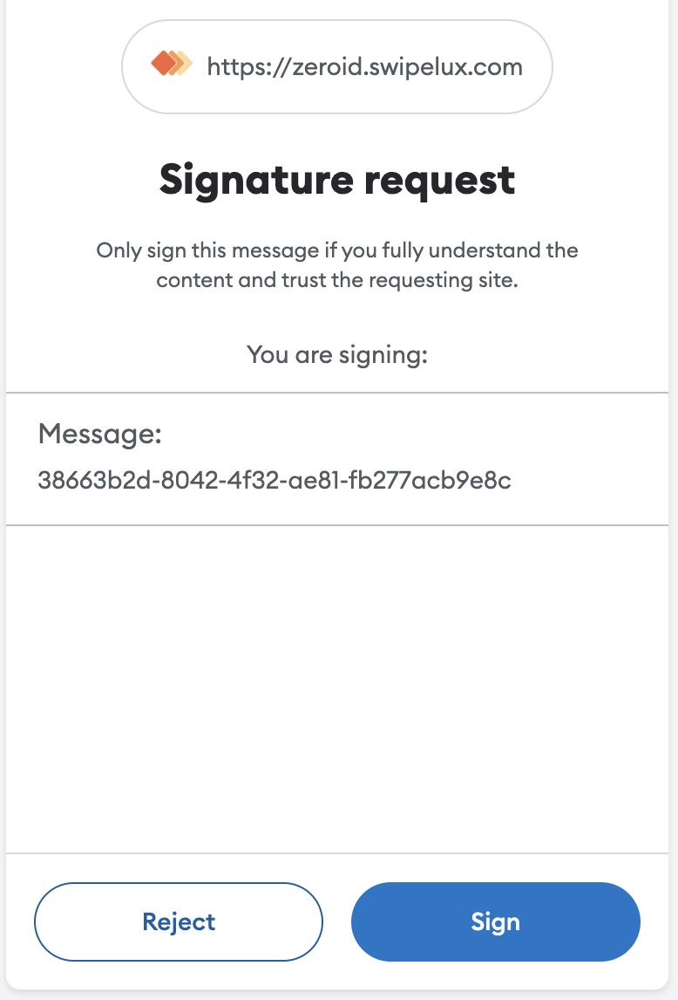
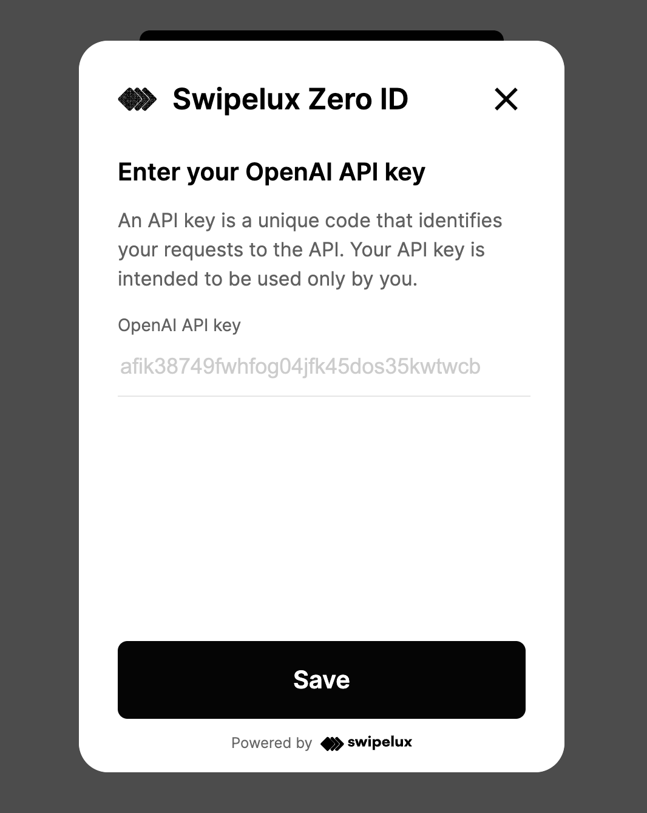

# ZeroID Key Storage

ZeroID is ingeniously applied to simplify API management for developers and users. With the ability to securely store, deploy, and access API keys without the hassle of manual cloning or input, it's a game-changer for the modern developer. This not only streamlines the process but also enhances security, making it a valuable tool in the realm of web3 and decentralized technologies.

Unlock the true potential of your projects without getting bogged down by manual API key management.

1) Seamless Integration Easily integrate ZeroID into your open-source projects and AI agents.

2) User-Friendly Interface - Designed with non-technical users in mind. No coding skills required.

3) Secure Storage - Your API keys are stored securely, ensuring data privacy and protection.

## How to use

1. Install SDK
2. Display the widget for the end user
3. Use end users API keys in your project

### Install

Just add the script tag to your head section of your HTML page.

```html
<!DOCTYPE html>
<html lang="en">
    <head>
        <meta charset="UTF-8">
        <title>Your site</title>
        <script src="https://zeroid.swipelux.com/sdk.js"></script>
    </head>
    <body>
    </body>
</html>

```

### Display widget

In the body section, add an HTML element for the widget to get placed to.

```html
<!DOCTYPE html>
<html lang="en">
    <head>
        <meta charset="UTF-8">
        <title>Your site</title>
        <script src="https://zeroid.swipelux.com/sdk.js"></script>
    </head>
    <body>
        <!-- div with sample id for the widget placement in further -->
        <div id="widget-here"></div>
    </body>
</html>
```

Now you can make the widget shown

```html
<!DOCTYPE html>
<html lang="en">
<head>
    <meta charset="UTF-8">
    <title>Your site</title>
    <script src="https://zeroid.swipelux.com/sdk.js"></script>
</head>
<body>
<!-- div with sample id for the widget placement in further -->
<div id="widget-here"></div>
<script>
    
    const placeForWidget = document.getElementById("widget-here");

    const zeroID = ZeroIdSdk.initStorage(placeForWidget);

</script>
</body>
</html>
```

After initialization the widget would look like this:


### Use widget

Using the widget requires Metamask to be installed. 
MetaMask is the most popular Ethereum wallet. It is a browser extension that allows you to interact with Ethereum dApps from your browser.
You can find out more about it on the [official website](https://metamask.io/).


When "My keys" button clicked for the first time click the Metamask signature request appears.



It is being used to identify the user by wallet, so then we can prepare a personal key bucket for you. <b>No fee is charged.</b>

Once signed, the key management pop-up is shown,

Where user can

- add
- update
- remove 

his <b>OpenAI API Key</b>



### Use your keys in code

After key is saved it can be retrieved in code by the application developer


```html
<!DOCTYPE html>
<html lang="en">
<head>
    <meta charset="UTF-8">
    <title>Your site</title>
    <script src="https://zeroid.swipelux.com/sdk.js"></script>
</head>
<body>
<!-- div with sample id for the widget placement in further -->
<div id="widget-here"></div>
<button id="btn">Create a request to OpenAI</button>
<div style="display: none" id="loading">Loading...</div>
<script>
    const placeForWidget = document.getElementById("widget-here");
    const zeroID = ZeroIdSdk.initStorage(placeForWidget);
    const btn = document.getElementById("btn");
    const loading = document.getElementById("loading");

    btn.onclick = () => {
        loading.style.display = "block";
        btn.style.display = "none";
        // using you OpenAI key
        zeroID.openAIKey()
                .then(res => res.value)
                .then(key => generateTextFromPhrase(
                                "Once upon a time...",
                                key
                        )
                )
                .then(res => res.json())
                .then(res => {
                    return res.choices[0].message.content;
                })
                .then(alert)
                .catch(console.err)
                .finally(() => {
                    loading.style.display = "none";
                    btn.style.display = "block";
                });
    }

    function generateTextFromPhrase(phrase, apiKey) {
        const OPEN_AI_API_PATH = 'https://api.openai.com/v1/chat/completions';

        const message = {
            role: 'user',
            content: phrase,
        };

        const requestData = {
            messages: [message],
            model: "gpt-3.5-turbo",
        };

        return fetch(OPEN_AI_API_PATH, {
            method: 'POST',
            headers: {
                'Content-Type': 'application/json',
                'Authorization': `Bearer ${apiKey}`
            },
            body: JSON.stringify(requestData)
        });
    }
</script>
</body>
</html>
```

### Why it's secure

Whilst the API-key are retrieved on client-side — user can see the exact code operating on it. 

Furthermore, instead of sharing users keys in public server environments you can now pass them unrevealed through the channel provided by authorized entity.

### Advanced 

The SDK can be used not only for OpenAI for the custom key-value pairs storing.

| Name            | Description               | Call example                        |
|-----------------|---------------------------|-------------------------------------|
| `credentials`   | Return all credentials    | `zeroID.credentials()`              |
| `credential`    | Return credential by name | `zeroID.credential(name)`           |
| `openAIKey`     | Return OpenAI key         | `zeroID.openAIKey()`                |
| `addCredential` | Add new credential        | `zeroID.addCredential(name, value)` |

```html
<body>
  ...
  <div id="widget-here"></div>
  
  <script>

    const placeForWidget = document.getElementById("widget-here");

    const zeroID = ZeroIdSdk.initStorage(placeForWidget);

    // using you OpenAI key
    await zeroID.addCredential(
      "AIRTABLE_KEY",
      "ww121490j304jjwq"
    );

    await zeroID
       .credential("AIRTABLE_KEY")
       .then(res => res.value)
       .then(console.log);
    
    // outputs: "ww121490j304jjwq"

    await zeroID
       .credentials()
       .then(console.log);

    /* {
        [ 
          {"AIRTABLE_KEY": "ww..jwq"},
          {"OPENAI_API_KEY": "sk-..."}, 
        ]
    }
     */
        
  </script>

</body>
```
